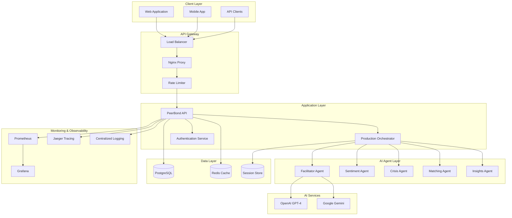
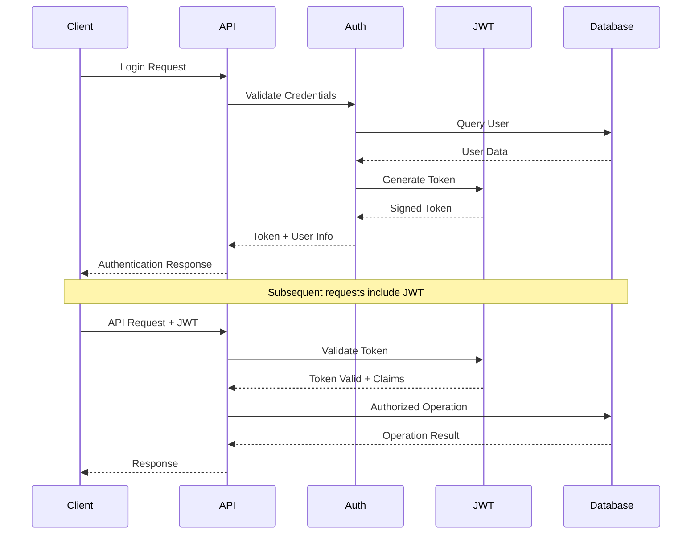
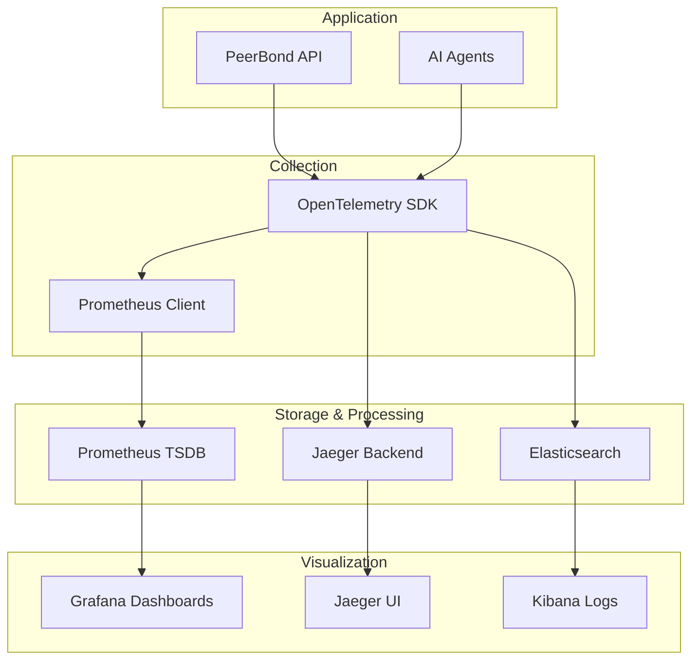

# PeerBond Architecture Guide

## System Architecture Overview

PeerBond implements a sophisticated multi-agent AI orchestration system designed for production-scale mental health support applications. The architecture emphasizes reliability, scalability, and HIPAA compliance.

## High-Level Architecture



## Core Components

### 1. Production Orchestrator Service

The central coordination hub that manages all AI agent interactions and conversation flow.

**Key Responsibilities:**
- Session lifecycle management
- Agent routing and coordination
- State persistence and recovery
- Performance monitoring and telemetry
- Crisis detection and escalation

**Architecture Pattern:** State Machine with Event-Driven Processing

```typescript
interface ProductionConversationState {
  sessionId: string;
  memberId: string;
  groupId?: string;
  messages: ProductionMessage[];
  currentAgent: string;
  messageCount: number;
  lastSentimentScore?: number;
  crisisLevel: 'none' | 'mild' | 'moderate' | 'severe';
  startTime: Date;
  lastActivity: Date;
  agentHistory: string[];
  metadata: Record<string, any>;
}
```

### 2. AI Agent System

Specialized agents handling different aspects of conversation management:

#### Facilitator Agent (Maya)
- **Primary Role**: Main conversation facilitator and emotional support
- **AI Models**: OpenAI GPT-4 (primary), Google Gemini (fallback)
- **Capabilities**:
  - Empathetic response generation
  - Therapeutic conversation guidance
  - Group dynamics management
  - Goal setting and tracking

#### Sentiment Agent
- **Primary Role**: Real-time emotional analysis and crisis detection
- **Processing**: Lightweight NLP with keyword detection
- **Capabilities**:
  - Sentiment scoring (-1.0 to 1.0 scale)
  - Crisis keyword detection
  - Mood trend analysis
  - Automatic escalation triggers

#### Crisis Agent
- **Primary Role**: Emergency intervention and resource provision
- **Activation**: Triggered by Sentiment Agent or manual escalation
- **Capabilities**:
  - Immediate crisis response
  - Emergency resource provision (988 hotline, etc.)
  - Escalation to human therapists
  - Documentation and audit trail

#### Matching Agent
- **Primary Role**: Intelligent peer and group matching
- **Algorithm**: Multi-factor compatibility scoring
- **Factors**:
  - Goal alignment (40% weight)
  - Experience level compatibility
  - Communication preferences
  - Availability and timezone
  - Language preferences

#### Insights Agent
- **Primary Role**: Analytics and therapeutic recommendations
- **Schedule**: Periodic analysis (every 10 messages or session end)
- **Outputs**:
  - Session summaries for therapists
  - Progress tracking and milestones
  - Intervention recommendations
  - Risk assessment updates

## Data Architecture

### Database Schema (PostgreSQL)

```sql
-- Core member and session management
CREATE TABLE members (
  id UUID PRIMARY KEY,
  email VARCHAR(255) UNIQUE NOT NULL,
  password_hash VARCHAR(255) NOT NULL,
  first_name VARCHAR(100),
  last_name VARCHAR(100),
  role VARCHAR(20) DEFAULT 'member',
  created_at TIMESTAMP DEFAULT NOW(),
  updated_at TIMESTAMP DEFAULT NOW()
);

-- Group management
CREATE TABLE groups (
  id UUID PRIMARY KEY,
  name VARCHAR(200) NOT NULL,
  description TEXT,
  type VARCHAR(50) NOT NULL,
  max_members INTEGER DEFAULT 8,
  is_private BOOLEAN DEFAULT false,
  facilitator_id UUID REFERENCES members(id),
  created_by UUID REFERENCES members(id),
  created_at TIMESTAMP DEFAULT NOW(),
  last_activity TIMESTAMP DEFAULT NOW()
);

-- Message storage
CREATE TABLE messages (
  id UUID PRIMARY KEY,
  group_id UUID REFERENCES groups(id),
  member_id UUID REFERENCES members(id),
  content TEXT NOT NULL,
  type VARCHAR(20) DEFAULT 'text',
  created_at TIMESTAMP DEFAULT NOW(),
  is_edited BOOLEAN DEFAULT false,
  metadata JSONB
);

-- Session and state management
CREATE TABLE orchestration_sessions (
  session_id VARCHAR(100) PRIMARY KEY,
  member_id UUID REFERENCES members(id),
  group_id UUID REFERENCES groups(id),
  state JSONB NOT NULL,
  created_at TIMESTAMP DEFAULT NOW(),
  updated_at TIMESTAMP DEFAULT NOW(),
  expires_at TIMESTAMP
);

-- Audit logging for HIPAA compliance
CREATE TABLE audit_logs (
  id UUID PRIMARY KEY,
  member_id UUID REFERENCES members(id),
  action VARCHAR(100) NOT NULL,
  resource VARCHAR(100),
  resource_id VARCHAR(100),
  details JSONB,
  ip_address INET,
  member_agent TEXT,
  created_at TIMESTAMP DEFAULT NOW()
);
```

### Caching Strategy (Redis)

```redis
# Session caching (1 hour TTL)
session:{sessionId} -> {compressed_state}

# Rate limiting
rate_limit:{ip}:{endpoint} -> {count}

# Agent response caching (5 minutes TTL)
agent_cache:{hash} -> {response}

# User profile caching (30 minutes TTL)
member:{memberId} -> {profile_data}
```

## Security Architecture

### Authentication & Authorization



### HIPAA Compliance Measures

1. **Data Encryption**
   - TLS 1.3 for data in transit
   - AES-256 encryption for data at rest
   - Encrypted database connections

2. **Access Controls**
   - JWT-based authentication
   - Role-based access control (RBAC)
   - Scope-limited API permissions

3. **Audit Logging**
   - Complete request/response logging
   - User action tracking
   - Data access monitoring
   - Retention policy compliance

4. **Data Minimization**
   - Limited data collection
   - Automatic data purging
   - Anonymization for analytics

## Monitoring & Observability Architecture

### Telemetry Stack



### Key Metrics

**System Metrics:**
- `peerbond_orchestration_active_sessions` - Current active sessions
- `peerbond_memory_usage_bytes` - Memory utilization
- `peerbond_cpu_usage_microseconds` - CPU utilization
- `peerbond_orchestration_uptime_seconds` - System uptime

**Business Metrics:**
- `orchestration_sessions_total` - Total sessions created
- `orchestration_messages_total` - Messages processed
- `orchestration_crisis_alerts_total` - Crisis interventions
- `orchestration_agent_calls_total` - Agent invocations by type

**Performance Metrics:**
- `orchestration_response_time_seconds` - Response time distribution
- `orchestration_confidence_score` - AI confidence levels
- `http_request_duration_ms` - HTTP request latency

## Deployment Architecture

### Container Architecture

```dockerfile
# Multi-stage build for optimization
FROM node:18-alpine AS base
FROM base AS development
FROM base AS production

# Security: Non-root member
RUN addgroup -g 1001 -S nodejs
RUN addmember -S nodejs -u 1001
USER nodejs

# Resource limits
HEALTHCHECK --interval=30s --timeout=3s --retries=3
```

### Infrastructure Components

**Production Stack:**
- **API Service**: Node.js application with clustering
- **Database**: PostgreSQL with connection pooling
- **Cache**: Redis for session storage and rate limiting
- **Monitoring**: Prometheus + Grafana + Jaeger stack
- **Proxy**: Nginx with SSL termination and load balancing

**Scaling Strategy:**
- Horizontal scaling via Docker replicas
- Database read replicas for analytics
- Redis clustering for high availability
- CDN for static assets

### Health Checks

```typescript
// Comprehensive health check implementation
interface HealthStatus {
  status: 'healthy' | 'degraded' | 'unhealthy';
  timestamp: string;
  version: string;
  system: {
    uptime: number;
    memory: NodeJS.MemoryUsage;
    cpu: NodeJS.CpuUsage;
  };
  orchestration: {
    activeSessions: number;
    maxSessions: number;
    utilizationPercent: number;
  };
  dependencies: {
    database: 'healthy' | 'unhealthy';
    cache: 'healthy' | 'unhealthy';
    ai_services: 'healthy' | 'degraded' | 'unhealthy';
  };
}
```

## Performance Considerations

### Optimization Strategies

1. **Connection Pooling**
   - PostgreSQL: 20 connections max
   - Redis: 10 connections per instance
   - HTTP keep-alive for AI services

2. **Caching Strategy**
   - Session state: 1 hour Redis TTL
   - Agent responses: 5 minutes for common queries
   - User profiles: 30 minutes with invalidation

3. **Resource Management**
   - Memory limits: 512MB per container
   - CPU limits: 0.5 cores per container
   - Session limits: 10,000 concurrent sessions

### Scalability Patterns

**Horizontal Scaling:**
- Stateless API design
- Session affinity via load balancer
- Database connection pooling

**Vertical Scaling:**
- Resource monitoring and auto-scaling
- Memory and CPU optimization
- Query performance tuning

## Error Handling & Recovery

### Circuit Breaker Pattern

```typescript
class AIServiceCircuitBreaker {
  private failureCount = 0;
  private lastFailureTime = 0;
  private state: 'CLOSED' | 'OPEN' | 'HALF_OPEN' = 'CLOSED';

  async call<T>(operation: () => Promise<T>): Promise<T> {
    if (this.state === 'OPEN') {
      if (Date.now() - this.lastFailureTime > this.timeout) {
        this.state = 'HALF_OPEN';
      } else {
        throw new Error('Circuit breaker is OPEN');
      }
    }

    try {
      const result = await operation();
      this.onSuccess();
      return result;
    } catch (error) {
      this.onFailure();
      throw error;
    }
  }
}
```

### Graceful Degradation

1. **AI Service Failures**
   - Primary: OpenAI GPT-4
   - Fallback: Google Gemini
   - Emergency: Template-based responses

2. **Database Failures**
   - Read replicas for redundancy
   - Cache-first for session data
   - Queue-based writes for durability

3. **Cache Failures**
   - Bypass cache, direct database access
   - Reduced performance but maintained functionality
   - Automatic cache warming on recovery

## Future Architecture Considerations

### Planned Enhancements

1. **Microservices Migration**
   - Service decomposition for better scalability
   - Event-driven architecture with message queues
   - Independent deployment and scaling

2. **Advanced AI Integration**
   - Fine-tuned models for mental health domain
   - Federated learning for privacy-preserving training
   - Real-time voice processing capabilities

3. **Global Distribution**
   - Multi-region deployment
   - Edge computing for reduced latency
   - Data sovereignty compliance

This architecture provides a solid foundation for scaling PeerBond to serve millions of members while maintaining the highest standards of reliability, security, and compliance for mental health applications.