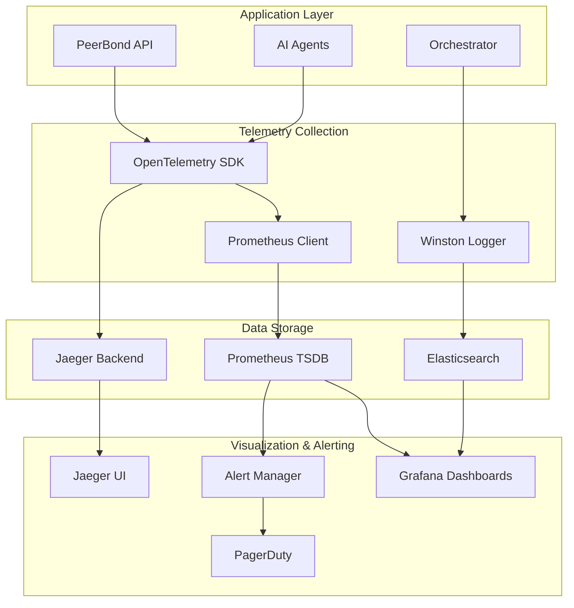

# PeerBond Monitoring & Observability Guide

## Overview

PeerBond implements comprehensive monitoring and observability using modern tools to ensure system reliability, performance optimization, and proactive issue detection.

## Monitoring Stack

### Architecture



## Metrics & KPIs

### System Metrics

#### Infrastructure Metrics

| Metric | Type | Description | Alert Threshold |
|--------|------|-------------|-----------------|
| `peerbond_orchestration_uptime_seconds` | Counter | System uptime | < 99.9% |
| `peerbond_memory_usage_bytes` | Gauge | Memory consumption | > 400MB |
| `peerbond_cpu_usage_microseconds` | Counter | CPU utilization | > 80% |
| `peerbond_orchestration_status` | Gauge | Health status (0/1/2) | < 2 |

#### Application Metrics

| Metric | Type | Description | Alert Threshold |
|--------|------|-------------|-----------------|
| `orchestration_active_sessions` | Gauge | Current active sessions | > 9000 |
| `orchestration_sessions_total` | Counter | Total sessions created | - |
| `orchestration_messages_total` | Counter | Messages processed | - |
| `orchestration_response_time_seconds` | Histogram | Response time distribution | p95 > 2s |

#### Business Metrics

| Metric | Type | Description | Alert Threshold |
|--------|------|-------------|-----------------|
| `orchestration_crisis_alerts_total` | Counter | Crisis interventions | > 10/hour |
| `orchestration_agent_calls_total` | Counter | Agent invocations by type | - |
| `orchestration_confidence_score` | Histogram | AI confidence distribution | avg < 0.6 |
| `orchestration_errors_total` | Counter | Error count by type | > 5% |

### Custom Metrics Collection

```typescript
// Metrics collection in orchestration service
import { OrchestrationTelemetry } from '../monitoring/telemetry';

class ProductionOrchestratorService {
  async processMessage(input: MessageInput): Promise<AgentResponse> {
    const startTime = Date.now();
    
    try {
      // Process message through agents
      const result = await this.processWithAgents(session, input.content);
      
      // Record metrics
      OrchestrationTelemetry.recordMessageProcessed(
        result.agentUsed,
        result.confidence,
        Date.now() - startTime,
        result.needsCrisisIntervention
      );
      
      return result;
    } catch (error) {
      OrchestrationTelemetry.recordError('processMessage', error.name, error.message);
      throw error;
    }
  }
}
```

## Prometheus Configuration

### Prometheus Setup

```yaml
# monitoring/prometheus.yml
global:
  scrape_interval: 15s
  evaluation_interval: 15s

scrape_configs:
  # PeerBond API metrics
  - job_name: 'peerbond-api'
    static_configs:
      - targets: ['peerbond-api:9464']
    scrape_interval: 10s
    metrics_path: '/metrics'

  # Node metrics
  - job_name: 'node-exporter'
    static_configs:
      - targets: ['node-exporter:9100']

  # PostgreSQL metrics
  - job_name: 'postgres-exporter'
    static_configs:
      - targets: ['postgres-exporter:9187']

  # Redis metrics
  - job_name: 'redis-exporter'
    static_configs:
      - targets: ['redis-exporter:9121']

# Recording rules for aggregated metrics
rule_files:
  - "recording_rules.yml"
  - "alert_rules.yml"
```

### Recording Rules

```yaml
# monitoring/recording_rules.yml
groups:
  - name: peerbond_recording_rules
    interval: 30s
    rules:
      # Request rate
      - record: peerbond:http_requests:rate5m
        expr: rate(http_request_duration_ms_count[5m])

      # Error rate
      - record: peerbond:http_errors:rate5m
        expr: rate(http_request_duration_ms_count{status_class="5xx"}[5m])

      # Average response time
      - record: peerbond:response_time:avg5m
        expr: |
          rate(http_request_duration_ms_sum[5m]) / 
          rate(http_request_duration_ms_count[5m])

      # Crisis alert rate
      - record: peerbond:crisis_alerts:rate1h
        expr: rate(orchestration_crisis_alerts_total[1h])

      # Agent success rate
      - record: peerbond:agent_success:rate5m
        expr: |
          rate(orchestration_agent_calls_total{status="success"}[5m]) /
          rate(orchestration_agent_calls_total[5m])

      # Session utilization
      - record: peerbond:session_utilization:current
        expr: orchestration_active_sessions / 10000 * 100
```

## Grafana Dashboards

### Main Orchestration Dashboard

```json
{
  "dashboard": {
    "id": null,
    "title": "PeerBond Orchestration Dashboard",
    "tags": ["peerbond", "orchestration", "production"],
    "timezone": "browser",
    "panels": [
      {
        "id": 1,
        "title": "System Health Overview",
        "type": "stat",
        "gridPos": {"h": 6, "w": 8, "x": 0, "y": 0},
        "targets": [
          {
            "expr": "peerbond_orchestration_status",
            "legendFormat": "System Status"
          },
          {
            "expr": "orchestration_active_sessions",
            "legendFormat": "Active Sessions"
          },
          {
            "expr": "rate(orchestration_sessions_total[5m]) * 60",
            "legendFormat": "Sessions/min"
          }
        ],
        "fieldConfig": {
          "defaults": {
            "mappings": [
              {"options": {"0": {"text": "Unhealthy", "color": "red"}}},
              {"options": {"1": {"text": "Degraded", "color": "yellow"}}},
              {"options": {"2": {"text": "Healthy", "color": "green"}}}
            ],
            "thresholds": {
              "steps": [
                {"color": "green", "value": null},
                {"color": "yellow", "value": 8000},
                {"color": "red", "value": 9000}
              ]
            }
          }
        }
      },
      {
        "id": 2,
        "title": "Crisis Interventions",
        "type": "stat",
        "gridPos": {"h": 6, "w": 8, "x": 8, "y": 0},
        "targets": [
          {
            "expr": "increase(orchestration_crisis_alerts_total[1h])",
            "legendFormat": "Crisis Alerts (1h)"
          },
          {
            "expr": "rate(orchestration_crisis_alerts_total[5m]) * 3600",
            "legendFormat": "Crisis Rate (per hour)"
          }
        ],
        "fieldConfig": {
          "defaults": {
            "color": {"mode": "thresholds"},
            "thresholds": {
              "steps": [
                {"color": "green", "value": null},
                {"color": "yellow", "value": 5},
                {"color": "red", "value": 10}
              ]
            }
          }
        }
      },
      {
        "id": 3,
        "title": "Response Time Distribution",
        "type": "graph",
        "gridPos": {"h": 8, "w": 12, "x": 0, "y": 6},
        "targets": [
          {
            "expr": "histogram_quantile(0.50, rate(orchestration_response_time_seconds_bucket[5m]))",
            "legendFormat": "50th percentile"
          },
          {
            "expr": "histogram_quantile(0.95, rate(orchestration_response_time_seconds_bucket[5m]))",
            "legendFormat": "95th percentile"
          },
          {
            "expr": "histogram_quantile(0.99, rate(orchestration_response_time_seconds_bucket[5m]))",
            "legendFormat": "99th percentile"
          }
        ],
        "yAxes": [
          {"label": "Response Time (seconds)", "min": 0}
        ]
      }
    ],
    "time": {"from": "now-1h", "to": "now"},
    "refresh": "30s"
  }
}
```

### Agent Performance Dashboard

```json
{
  "dashboard": {
    "title": "AI Agent Performance",
    "panels": [
      {
        "title": "Agent Usage Distribution",
        "type": "piechart",
        "targets": [
          {
            "expr": "rate(orchestration_agent_calls_total[5m])",
            "legendFormat": "{{agent_name}}"
          }
        ]
      },
      {
        "title": "Agent Confidence Scores",
        "type": "heatmap",
        "targets": [
          {
            "expr": "rate(orchestration_confidence_score_bucket[5m])",
            "legendFormat": "Confidence Distribution"
          }
        ]
      },
      {
        "title": "Agent Error Rates",
        "type": "graph",
        "targets": [
          {
            "expr": "rate(orchestration_errors_total[5m]) by (agent_name)",
            "legendFormat": "{{agent_name}} errors"
          }
        ]
      }
    ]
  }
}
```

## Alerting Configuration

### Alert Rules

```yaml
# monitoring/alert_rules.yml
groups:
  - name: peerbond_critical_alerts
    rules:
      - alert: SystemDown
        expr: up{job="peerbond-api"} == 0
        for: 1m
        labels:
          severity: critical
          service: peerbond-api
        annotations:
          summary: "PeerBond API is down"
          description: "PeerBond API has been down for more than 1 minute"
          runbook_url: "https://docs.peerbond.com/runbooks/api-down"

      - alert: HighCrisisAlertRate
        expr: rate(orchestration_crisis_alerts_total[5m]) > 0.1
        for: 2m
        labels:
          severity: critical
          service: orchestration
        annotations:
          summary: "High crisis alert rate detected"
          description: "Crisis alerts occurring at {{ $value }} per second"
          runbook_url: "https://docs.peerbond.com/runbooks/crisis-surge"

      - alert: HighResponseTime
        expr: histogram_quantile(0.95, rate(orchestration_response_time_seconds_bucket[5m])) > 2
        for: 5m
        labels:
          severity: warning
          service: orchestration
        annotations:
          summary: "High response time detected"
          description: "95th percentile response time is {{ $value }}s"

      - alert: HighErrorRate
        expr: rate(orchestration_errors_total[5m]) / rate(orchestration_messages_total[5m]) > 0.05
        for: 3m
        labels:
          severity: critical
          service: orchestration
        annotations:
          summary: "High error rate detected"
          description: "Error rate is {{ $value | humanizePercentage }}"

      - alert: SessionLimitApproaching
        expr: orchestration_active_sessions > 9000
        for: 1m
        labels:
          severity: warning
          service: orchestration
        annotations:
          summary: "Session limit approaching"
          description: "Active sessions: {{ $value }}/10000"

  - name: peerbond_performance_alerts
    rules:
      - alert: HighMemoryUsage
        expr: peerbond_memory_usage_bytes{type="heapUsed"} / peerbond_memory_usage_bytes{type="heapTotal"} > 0.9
        for: 5m
        labels:
          severity: warning
          service: peerbond-api
        annotations:
          summary: "High memory usage"
          description: "Memory usage is {{ $value | humanizePercentage }}"

      - alert: DatabaseConnectionIssues
        expr: up{job="postgres-exporter"} == 0
        for: 2m
        labels:
          severity: critical
          service: database
        annotations:
          summary: "Database connection issues"
          description: "Cannot connect to PostgreSQL database"

      - alert: RedisConnectionIssues
        expr: up{job="redis-exporter"} == 0
        for: 2m
        labels:
          severity: warning
          service: cache
        annotations:
          summary: "Redis connection issues"
          description: "Cannot connect to Redis cache"

  - name: peerbond_business_alerts
    rules:
      - alert: LowAIConfidence
        expr: avg(orchestration_confidence_score) < 0.6
        for: 10m
        labels:
          severity: warning
          service: ai-agents
        annotations:
          summary: "Low AI confidence detected"
          description: "Average AI confidence is {{ $value | humanizePercentage }}"

      - alert: AgentFailures
        expr: rate(orchestration_agent_calls_total{status="error"}[5m]) / rate(orchestration_agent_calls_total[5m]) > 0.1
        for: 5m
        labels:
          severity: warning
          service: ai-agents
        annotations:
          summary: "High agent failure rate"
          description: "Agent failure rate is {{ $value | humanizePercentage }}"
```

### Alert Manager Configuration

```yaml
# monitoring/alertmanager.yml
global:
  smtp_smarthost: 'smtp.yourdomain.com:587'
  smtp_from: 'alerts@peerbond.com'

route:
  group_by: ['alertname', 'service']
  group_wait: 10s
  group_interval: 10s
  repeat_interval: 1h
  receiver: 'default'
  routes:
    - match:
        severity: critical
      receiver: 'critical-alerts'
    - match:
        service: orchestration
      receiver: 'orchestration-team'

receivers:
  - name: 'default'
    email_configs:
      - to: 'team@peerbond.com'
        subject: '[PeerBond] {{ .GroupLabels.alertname }}'
        body: |
          {{ range .Alerts }}
          Alert: {{ .Annotations.summary }}
          Description: {{ .Annotations.description }}
          {{ end }}

  - name: 'critical-alerts'
    email_configs:
      - to: 'oncall@peerbond.com'
        subject: '[CRITICAL] PeerBond Alert'
    pagerduty_configs:
      - service_key: 'your-pagerduty-service-key'
        description: '{{ .GroupLabels.alertname }}'

  - name: 'orchestration-team'
    slack_configs:
      - api_url: 'https://hooks.slack.com/services/...'
        channel: '#orchestration-alerts'
        title: 'PeerBond Orchestration Alert'
        text: '{{ range .Alerts }}{{ .Annotations.summary }}{{ end }}'
```

## Distributed Tracing

### Jaeger Configuration

```typescript
// Tracing spans for orchestration operations
import { OrchestrationTelemetry } from '../monitoring/telemetry';

export class ProductionOrchestratorService {
  async processMessage(input: MessageInput): Promise<AgentResponse> {
    return OrchestrationTelemetry.traceOperation(
      'orchestration.process_message',
      async (span) => {
        span.setAttributes({
          'user.id': input.userId,
          'session.id': input.sessionId,
          'message.length': input.content.length,
        });

        // Process through agents with child spans
        const result = await this.processWithAgents(session, input.content);
        
        span.setAttributes({
          'response.confidence': result.confidence,
          'agents.used': result.agentUsed.join(','),
          'crisis.detected': result.needsCrisisIntervention,
        });

        return result;
      }
    );
  }

  private async facilitatorAgent(content: string): Promise<AgentResult> {
    return OrchestrationTelemetry.traceAgentOperation(
      'facilitator',
      async (span) => {
        span.setAttributes({
          'agent.model': 'gpt-4',
          'message.type': 'user_input',
        });

        const result = await this.agent.process(content);
        
        span.setAttributes({
          'agent.confidence': result.confidence,
          'response.length': result.response.length,
        });

        return result;
      }
    );
  }
}
```

### Trace Analysis Queries

```javascript
// Jaeger UI queries for common investigations

// Find slow requests
operation:"orchestration.process_message" AND duration:>2s

// Find crisis interventions
tag:"crisis.detected:true"

// Find agent failures
tag:"error:true" AND operation:"agent.*"

// Find high-confidence responses
tag:"response.confidence:>0.9"

// Find sessions with multiple crisis alerts
tag:"user.id:user_123" AND tag:"crisis.detected:true"
```

## Log Management

### Structured Logging

```typescript
// Enhanced logging with correlation IDs
import { OrchestrationLogger } from '../monitoring/logging';

export class ProductionOrchestratorService {
  private logger: OrchestrationLogger;

  constructor() {
    this.logger = new OrchestrationLogger();
  }

  async processMessage(input: MessageInput): Promise<AgentResponse> {
    const sessionLogger = OrchestrationLogger.withSession(
      input.sessionId, 
      input.userId
    );

    sessionLogger.logSessionEvent(
      'message_processed',
      input.sessionId,
      input.userId,
      {
        messageLength: input.content.length,
        messageType: input.messageType
      }
    );

    try {
      const result = await this.processWithAgents(session, input.content);
      
      if (result.needsCrisisIntervention) {
        sessionLogger.logCrisisIntervention(
          input.sessionId,
          input.userId,
          'severe',
          ['suicide_ideation'],
          { confidence: result.confidence }
        );
      }

      return result;
    } catch (error) {
      sessionLogger.logError(error, 'processMessage', {
        sessionId: input.sessionId,
        userId: input.userId
      });
      throw error;
    }
  }
}
```

### Log Aggregation (ELK Stack)

```yaml
# docker-compose.monitoring.yml
services:
  elasticsearch:
    image: docker.elastic.co/elasticsearch/elasticsearch:8.8.0
    environment:
      - discovery.type=single-node
      - "ES_JAVA_OPTS=-Xms512m -Xmx512m"
    ports:
      - "9200:9200"

  logstash:
    image: docker.elastic.co/logstash/logstash:8.8.0
    volumes:
      - ./logstash/pipeline:/usr/share/logstash/pipeline:ro
    ports:
      - "5000:5000"
    depends_on:
      - elasticsearch

  kibana:
    image: docker.elastic.co/kibana/kibana:8.8.0
    ports:
      - "5601:5601"
    depends_on:
      - elasticsearch
```

### Logstash Pipeline

```ruby
# logstash/pipeline/peerbond.conf
input {
  beats {
    port => 5044
  }
  tcp {
    port => 5000
    codec => json_lines
  }
}

filter {
  if [service] == "peerbond-orchestration" {
    # Parse orchestration logs
    if [event] == "crisis_intervention" {
      mutate {
        add_tag => ["crisis", "high_priority"]
      }
    }
    
    if [level] == "error" {
      mutate {
        add_tag => ["error", "needs_attention"]
      }
    }
    
    # Extract user ID for correlation
    if [userId] {
      mutate {
        add_field => { "user_hash" => "%{userId}" }
      }
      
      # Hash user ID for privacy
      ruby {
        code => "
          require 'digest'
          event.set('user_hash', Digest::SHA256.hexdigest(event.get('userId'))[0..8])
          event.remove('userId')
        "
      }
    }
  }
}

output {
  elasticsearch {
    hosts => ["elasticsearch:9200"]
    index => "peerbond-%{+YYYY.MM.dd}"
  }
  
  if "crisis" in [tags] {
    # Send crisis alerts to separate index
    elasticsearch {
      hosts => ["elasticsearch:9200"]
      index => "peerbond-crisis-%{+YYYY.MM.dd}"
    }
  }
}
```

## Performance Monitoring

### SLA Monitoring

```yaml
# SLA definitions
slas:
  api_availability:
    target: 99.9%
    measurement: up{job="peerbond-api"}
    
  response_time:
    target: "95% of requests < 2s"
    measurement: histogram_quantile(0.95, rate(orchestration_response_time_seconds_bucket[5m]))
    
  crisis_response_time:
    target: "100% of crisis alerts < 30s"
    measurement: histogram_quantile(1.0, rate(orchestration_response_time_seconds_bucket{operation="crisis"}[5m]))
    
  error_rate:
    target: "< 1% error rate"
    measurement: rate(orchestration_errors_total[5m]) / rate(orchestration_messages_total[5m])
```

### Synthetic Monitoring

```javascript
// Synthetic tests for critical paths
const synthetics = {
  // Health check test
  healthCheck: {
    url: 'https://api.peerbond.com/health',
    interval: '30s',
    assertions: [
      { property: 'status', operator: 'equals', value: 200 },
      { property: 'body.data.status', operator: 'equals', value: 'healthy' },
      { property: 'responseTime', operator: 'lessThan', value: 1000 }
    ]
  },

  // Session creation test
  sessionCreation: {
    url: 'https://api.peerbond.com/api/production-orchestration/session/start',
    method: 'POST',
    headers: { 'Authorization': 'Bearer {{auth_token}}' },
    body: { userProfile: { goals: ['synthetic-test'] } },
    interval: '5m',
    assertions: [
      { property: 'status', operator: 'equals', value: 200 },
      { property: 'body.success', operator: 'equals', value: true },
      { property: 'responseTime', operator: 'lessThan', value: 2000 }
    ]
  },

  // Message processing test
  messageProcessing: {
    url: 'https://api.peerbond.com/api/production-orchestration/message',
    method: 'POST',
    headers: { 'Authorization': 'Bearer {{auth_token}}' },
    body: {
      sessionId: '{{session_id}}',
      content: 'This is a synthetic test message for monitoring.'
    },
    interval: '5m',
    assertions: [
      { property: 'status', operator: 'equals', value: 200 },
      { property: 'body.data.confidence', operator: 'greaterThan', value: 0.5 },
      { property: 'responseTime', operator: 'lessThan', value: 3000 }
    ]
  }
};
```

## Runbooks

### Crisis Alert Response

```markdown
# Crisis Alert Runbook

## Immediate Actions (< 2 minutes)
1. Acknowledge alert in PagerDuty
2. Check Grafana crisis dashboard for scale/scope
3. Verify alert is not false positive
4. If legitimate, escalate to mental health crisis team

## Investigation Steps
1. Check recent crisis alert logs in Kibana
2. Identify affected users (search by session IDs)
3. Verify automatic crisis response was sent
4. Check if external crisis services are reachable

## Escalation Criteria
- Multiple crisis alerts in 5 minutes
- Crisis response system not functioning
- External crisis services unreachable

## Contact Information
- Crisis Team Lead: +1-555-CRISIS
- Mental Health Director: +1-555-DIRECTOR
- PagerDuty: crisis-team@peerbond.pagerduty.com
```

### High Response Time Runbook

```markdown
# High Response Time Runbook

## Immediate Checks
1. Check system load: Grafana > System Overview
2. Verify database performance: PostgreSQL dashboard
3. Check AI service status: External services panel
4. Review error logs for bottlenecks

## Common Causes & Solutions
1. **High Session Count**: Scale horizontally if > 8000 sessions
2. **Database Slow Queries**: Check pg_stat_statements
3. **AI Service Latency**: Switch to fallback model
4. **Memory Pressure**: Restart API service if heap > 400MB

## Mitigation Steps
1. Enable circuit breaker for slow AI services
2. Increase database connection pool
3. Activate read replicas for heavy queries
4. Scale API service instances
```

This comprehensive monitoring guide ensures PeerBond maintains high availability, performance, and reliability while providing deep insights into system behavior and user experience.